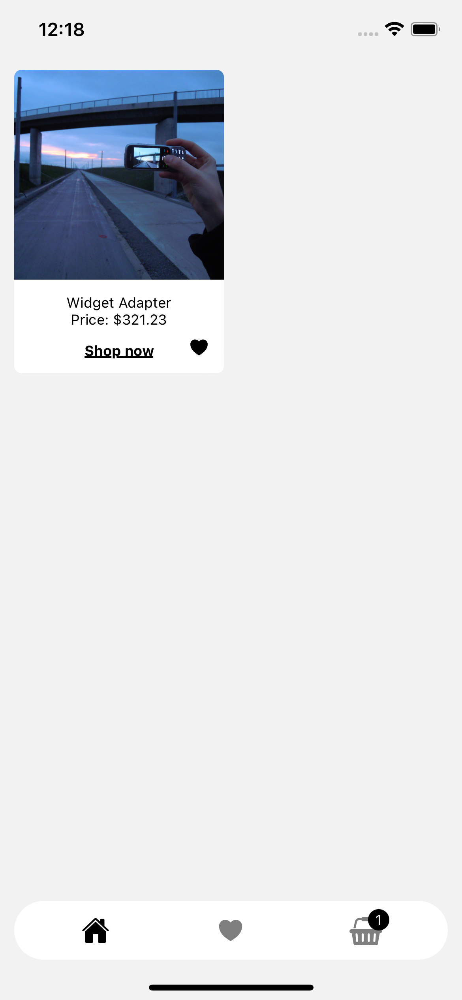
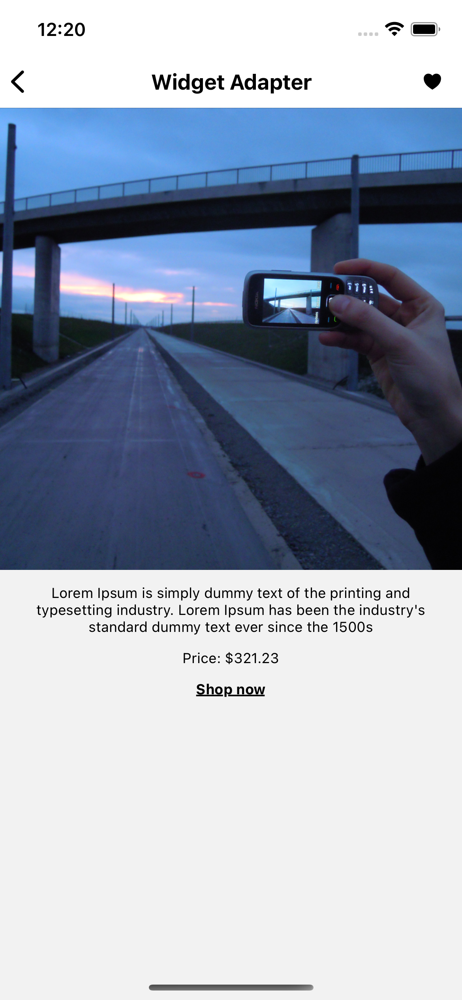
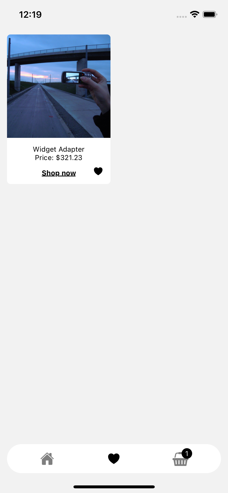
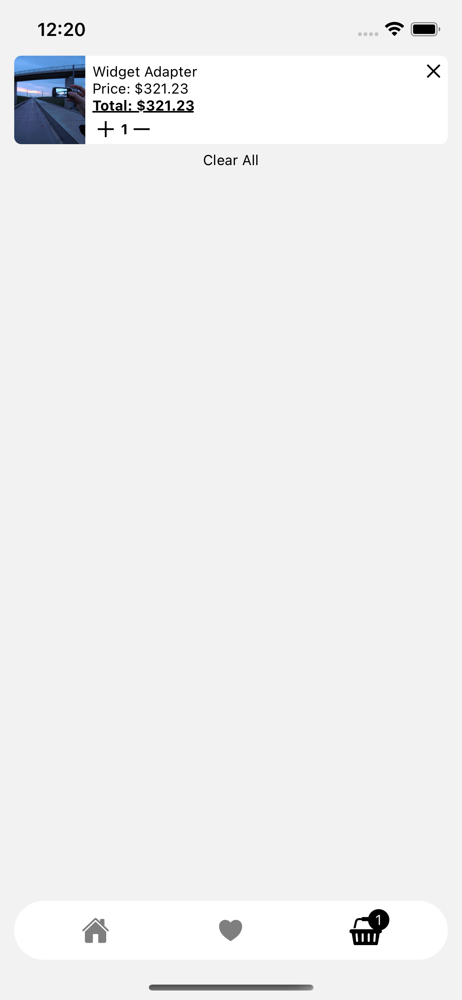

# Bagzz app

#### [Test task requirement]('./docs/test-task-requirements.pdf')

#### Application screenshots

    
    
    
    

### How do I get set up?

#### Required software

- [Node.js](https://nodejs.org/en/) Node v14.18.0 or newer
- [React Native CLI](https://facebook.github.io/react-native/docs/getting-started.html) with its dependencies for Native Code development
- [XCode](https://developer.apple.com/xcode/) with CLI tools
- [Android Studio](https://developer.android.com/studio/index.html)
- [Yarn](https://yarnpkg.com/en/)

#### Install dependencies

1. install dependencies with `yarn`
2. install dependencies with `(cd ios && pod install)`

#### Run IOS

- run with `yarn ios`

#### Run Android

- bootstrap the emulator
- run with `yarn android`

### Type checking

- run the type checker with `npx tsc`

### Lint checking

- run the type checker with `yarn lint`
